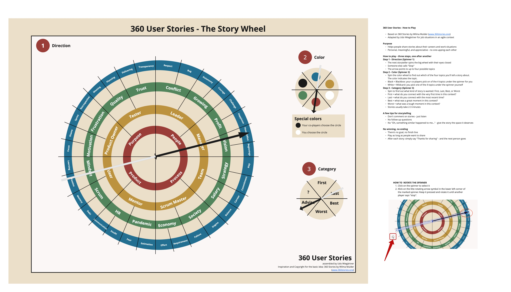

# 360 User Stories – The Story Wheel

> A storytelling game for agile teams, coaches, and anyone who wants to share work experiences in a meaningful way.

- Based on **360 Stories** by Wilma Mulder ([www.360stories.one](https://www.360stories.one))
- Adapted by **Udo Wiegärtner** for job situations in an agile context

---

## 🎯 Purpose

Help people share stories about their **careers and work situations** – personal, meaningful, and appreciative. No one-upping each other, just listening.

---

## 🎲 How to Play

Three steps, one after another.

### 1️⃣ Direction (Spinner 1)

- The next storyteller spins the big wheel **with eyes closed**
- Someone else calls **"Stop"**
- The arrow points to up to **four possible topics**

### 2️⃣ Color (Spinner 2)

Spin the color wheel to find out which of the four topics you'll tell a story about.

| Color | Meaning |
|---|---|
| 🔴 🟢 🟡 🔵 | One of the four topics under the arrow |
| ⚫ **Black** | Blackbox – your co-players pick the topic for you |
| ⚪ **White** | Wildcard – you pick the topic yourself |

### 3️⃣ Category (Spinner 3)

Spin to find out what kind of story is wanted:

- **First** – what do you connect with the very first time in this context?
- **Last** – what do you connect with the most recent time?
- **Best** – what was a great moment in this context?
- **Worst** – what was a tough moment in this context?

⏱ Stories usually take **2–3 minutes**.

---

## 💡 Tips for Storytelling

- **Don't comment** on stories – just listen
- **No follow-up questions**
- **No "Oh, something similar happened to me…"** – give the story the space it deserves

---

## 🏁 No Winning, No Ending

- There's no goal, no finish line
- Play as long as people want to share
- After each story: simply say **"Thanks for sharing"** – and the next person goes

---

## 🛠 Installation

This repo contains an **.rtb file** – a Miro board export (Real-Time Board backup).

To use it:
1. Download the `.rtb` file from this repo (this is a backup of the Miro board)
1. Open [Miro](https://miro.com) and go to your dashboard
2. Click **"+ Create New"** → **"Import"** → **"Import Backup"** (or use the import option in your team workspace)
3. Select the `.rtb` file you downloaded
4. Miro recreates the full board – ready to spin

## License

**360 User Stories** is an unofficial community variant and is not affiliated with or endorsed by the publisher of the original **360 Stories** game. All rights to the original game remain with their respective owners.

This variant is an independent fan work and makes no claim to the trademark or intellectual property of the original game.

360 User Stories was created by Udo Wiegärtner

Licensed under [Creative Commons Attribution-NonCommercial-ShareAlike 4.0 International (CC BY-NC-SA 4.0)](https://creativecommons.org/licenses/by-nc-sa/4.0/).

You are free to:
- **Share** - copy and redistribute the material in any medium or format
- **Adapt** - remix, transform, and build upon the material

Under the following terms:
- **Attribution (BY)** - You must give appropriate credit and name the authors listed above as the source
- **NonCommercial (NC)** - You may not use the material for commercial purposes
- **ShareAlike (SA)** - If you remix or adapt the material, you must distribute your contribution under the same license
